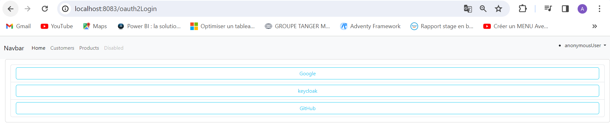

<ul>-La création d'un Realm appelé Sdia-realm</ul>

<ul>-La création d'un client appelé sdia-customer-client</ul>

<li>-La création d'un autre client dans le Realm "sdia-customer"</li>

<ul>-La création des rôles 'admin' et 'user'</ul>

<ul>-La création de l'utilisateur 'user1' </ul>

<ul>-Attribuer le rôle "ADMIN" et "USER" à notre utilisateur "user2".</ul>

<ul>-Attribuer le rôle "USER"  à notre utilisateur "user1".</ul>

<ul>- Page Login with 02Auth</ul>

<ul>Authentification avec Google pour accéder à la page des clients "Customers"</ul>

<li> Avec Github</li>

<li> Avec Keycloak</li>

<ul>inventtory_db (Mysql)</ul>
